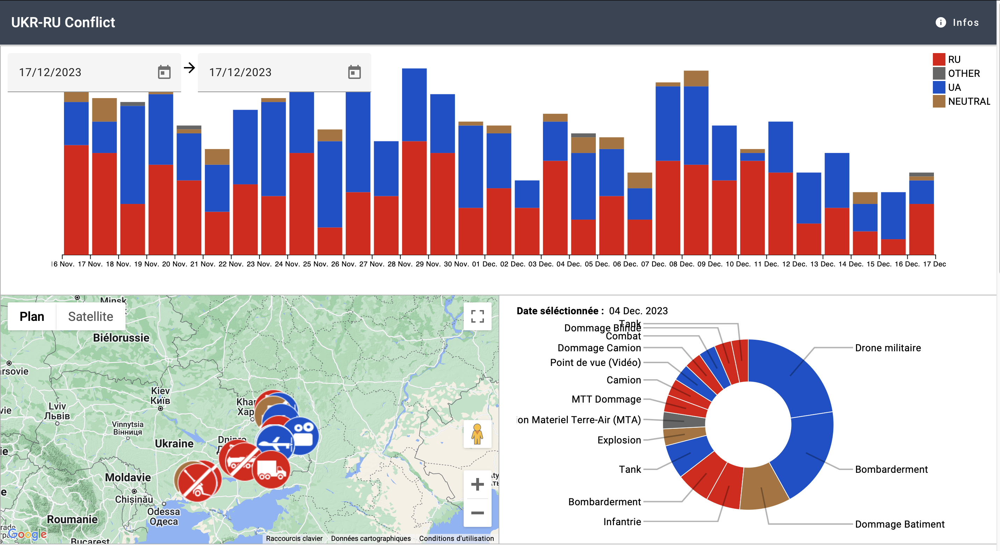

# Visualization of the Russo-Ukranian conflict

# Authors
- Chafaatou Mahamadou Kona
- Melvyn Bertolone

# UI Framework
Material : https://material.angular.io/

# Installation and running
-  Go to web project:
    ```shell
        cd dataViz-project
    ```
- Install dependencies :
    ```shell
        npm install
    ```
- Run the server: 
    ```shell
        ng serve
    ```

# Data
- Ukraine Geojson: https://github.com/EugeneBorshch/ukraine_geojson/tree/master
- Russia GeoJson: https://github.com/simp37/Russia_geoJSON
- Conflict data: https://geoconfirmed.org/api/placemark/Ukraine

# Github page
- https://belosem.github.io/DataViz-Projet/


## Description

The Russo-Ukrainian conflict visualization site responds to the growing need for understanding and easy access to events related to this complex conflict. Faced with the overabundance of scattered, often contradictory information, and the difficulty for users to follow the temporal evolution of events, this project aims to provide an interactive and informative platform. By combining an interactive map, a timeline, media related to each event, and an activity heatmap, the site aims to offer a complete user experience to understand and follow in a clear and objective manner the evolution of the Russo-Ukrainian conflict, while encouraging fact-checking from reliable sources.

# Sketches

- version 1


- version 2


## Target audience and tasks performed in this project

This visualization is aimed at a varied audience, including researchers, journalists, students, and the general public wishing to understand the complex evolution of this conflict.
The main tasks that the project will accomplish are:

- Analyze the most recent events in the Russo-Ukrainian conflict.
- Verify the authenticity of events by accessing associated multimedia evidence, such as images and videos.
- Explore the temporal evolution of the conflict to identify periods of intense activity and moments of relative stability.

## Dataset

- Geographic data of regions of Ukraine: https://github.com/EugeneBorshch/ukraine_geojson/tree/master
- Geographic data of regions of Russia: https://github.com/simp37/Russia_geoJSON  
Main interest: This data provides detailed geographic information about regions of both countries, which is essential for creating an accurate interactive map. They allow events to be visualized in their spatial context.  
Potential limitations: Data may become obsolete if territorial changes occur. Accuracy depends on updating the dataset regularly.
- Data relating to conflict events: https://geoconfirmed.org/api/placemark/Ukraine
Main interest: These data offer specific information (evidence, types of events, etc.) on events linked to the Russo-Ukrainian conflict, allowing real-time updating of the interactive map and timeline.  
Potential limitations of this data include the reliability of the source and we guarantee that it comes from a reliable source. Each event is linked to its source in the visualization.

## Organization

- Means of communication: Discord, Tracking Github
- Identified roles: design, D3 development, deployment

## Work related to the project

- https://geoconfirmed.org
- https://abardou.github.io/viz-habits/#/vitrine